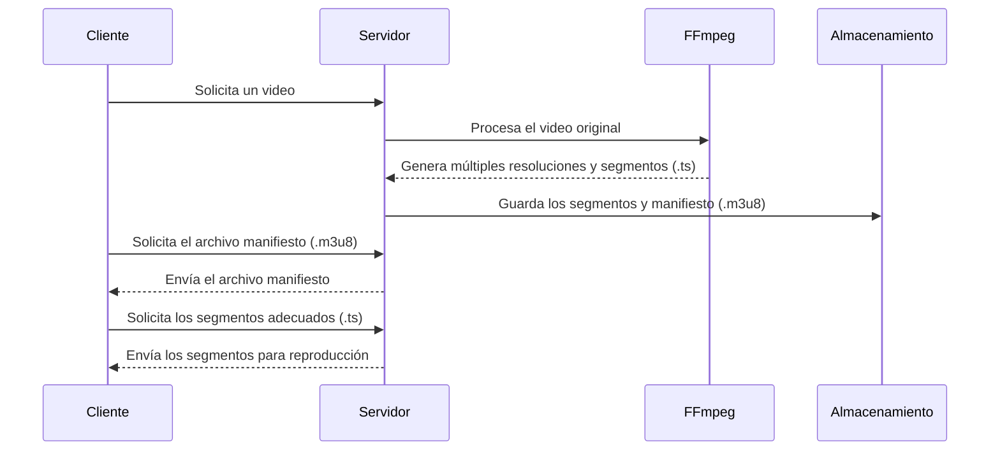
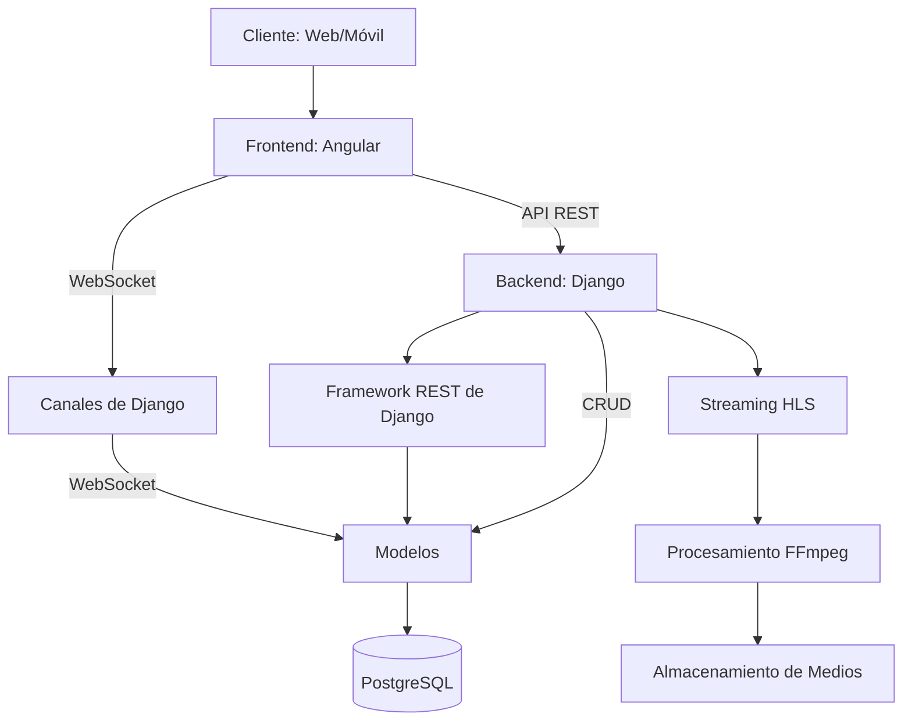

# Arquitectura del Backend

Esta página detalla la estructura y organización del backend de Cinecloud, proporcionando una comprensión clara de cómo interactúan sus componentes.

## Estructura del proyecto

La arquitectura de Cinecloud Backend sigue un diseño modular basado en aplicaciones Django:

```
├── cinecloud           # Aplicación principal del proyecto
│   ├── asgi.py         # Configuración ASGI para canales WebSocket
│   ├── consumers.py    # Consumidores WebSocket
│   ├── hls_utils.py    # Utilidades para streaming HLS
│   ├── models.py       # Modelos generales de la aplicación
│   ├── routing.py      # Enrutamiento para canales WebSocket
│   ├── serializers.py  # Serializadores para la API REST
│   ├── settings.py     # Configuración del proyecto
│   ├── urls.py         # URLs del proyecto
│   ├── views.py        # Vistas generales
│   └── wsgi.py         # Configuración WSGI
├── Peliculas              # Aplicación para gestión de películas
├── series              # Aplicación para gestión de series
├── Usuarios               # Aplicación para gestión de usuarios
├── database            # Configuración de base de datos
├── manage.py           # Script de administración de Django
├── requirements.txt    # Dependencias del proyecto
├── Dockerfile          # Configuración para Docker
├── docker-compose.yml  # Configuración para Docker Compose
└── start.sh            # Script de inicio
```

## Componentes principales

### Aplicación Core (cinecloud)

La aplicación principal que coordina todas las funcionalidades del sistema:

- **settings.py**: Configuración centralizada de Django, incluyendo bases de datos, aplicaciones instaladas y middleware
- **urls.py**: Punto de entrada para todas las rutas de la API
- **asgi.py/wsgi.py**: Configuraciones para servidores ASGI y WSGI
- **consumers.py**: Implementación de WebSockets para streaming en tiempo real
- **hls_utils.py**: Utilidades para la implementación de HTTP Live Streaming

### Aplicaciones específicas

#### Peliculas

Gestiona todo lo relacionado con películas:

- Modelos para películas y metadatos
- Vistas para listar, crear, actualizar y eliminar películas
- Lógica para categorización y búsqueda
- Procesamiento de archivos de video

#### Series

Similar a Peliculas, pero con estructuras adicionales:

- Gestión de temporadas
- Gestión de episodios
- Relaciones entre temporadas y series

#### Usuarios

Gestiona la autenticación y autorización:

- Perfiles de usuario extendidos
- Preferencias de usuario
- Historial de visualización
- Sistemas de recomendación

## Flujo de datos

1. El cliente realiza una solicitud a través de la API REST o WebSocket
2. Los middleware procesan la solicitud (autenticación, CORS, etc.)
3. La solicitud se dirige a la vista o consumidor correspondiente
4. Se accede a los modelos de datos según sea necesario
5. Se procesa la lógica de negocio
6. Se serializa la respuesta
7. Se envía la respuesta al cliente

## Patrones de diseño

Cinecloud Backend implementa varios patrones de diseño:

- **MVC (Modelo-Vista-Controlador)**: Separación clara entre modelos de datos, vistas y controladores (llamados "vistas" en Django)
- **REST**: API basada en recursos con operaciones CRUD estándar
- **Middleware**: Capas de procesamiento para solicitudes entrantes y salientes
- **Serialización**: Conversión de objetos complejos a formatos transmisibles (JSON)
- **Dependency Injection**: A través del sistema de middleware y signals de Django

## Sistema de streaming HLS

El streaming de video utiliza HTTP Live Streaming (HLS) para proporcionar reproducción adaptativa:

1. Los videos originales se procesan con FFmpeg
2. Se generan múltiples versiones del video a diferentes resoluciones
3. Los videos se segmentan en fragmentos pequeños (.ts)
4. Se crea un archivo de manifiesto (.m3u8) que enumera los segmentos
5. El cliente solicita el manifiesto y reproduce los segmentos adecuados según su ancho de banda



## Diagrama de arquitectura



## Seguridad

La aplicación implementa varias capas de seguridad:

- Autenticación basada en tokens
- Manejo seguro de sesiones
- Protección contra CSRF
- Validación de entrada
- Sanitización de salida
- Seguridad a nivel de modelo (permisos de objeto)

## Escalabilidad

La arquitectura está diseñada para escalar horizontalmente:

- Separación clara entre componentes
- Uso de bases de datos relacionales robustas
- Soporte para balanceo de carga
- Procesamiento asíncrono para tareas pesadas
- Modelos de caché para reducir carga de base de datos

