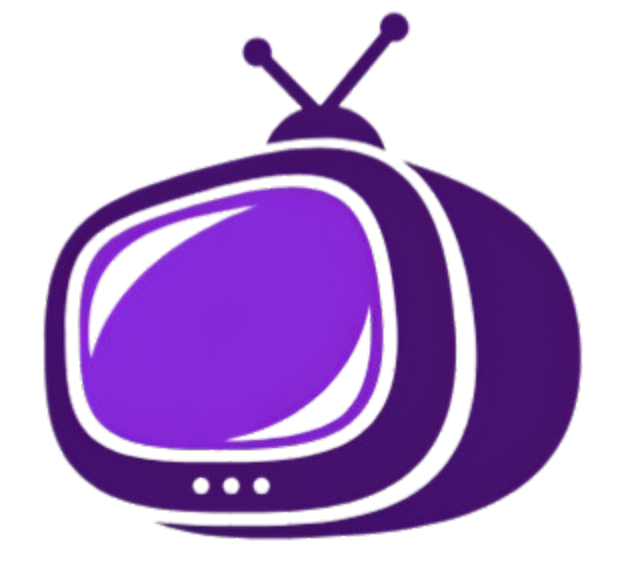

# Bienvenido a la Documentación de Cinecloud

    

## Acerca de Cinecloud

Cinecloud es una plataforma de streaming completa que ofrece a los usuarios una experiencia fluida para ver películas y series. La plataforma está dividida en dos componentes principales:

- **Backend**: Desarrollado en Django, proporciona APIs robustas, autenticación de usuarios, y servicios de streaming HLS.
- **Frontend**: Desarrollado en Angular, ofrece una interfaz de usuario moderna y responsive para acceder al contenido multimedia.

## Características principales

- **Streaming adaptativo**: Tecnología HLS para una reproducción fluida en diferentes condiciones de red
- **Gestión de contenido**: Categorización completa de películas y series
- **Autenticación segura**: Sistema robusto de registro y control de acceso
- **Diseño responsive**: Experiencia optimizada para todos los dispositivos
- **Arquitectura escalable**: Diseñada para soportar crecimiento en usuarios y contenido

## Comenzando

¿Buscas configurar Cinecloud? Explora nuestra documentación:

- [Configuración del Backend](backend/instalacion.md): Aprende a instalar y configurar el servidor Django
- [Configuración del Frontend](frontend/instalacion.md): Pasos para instalar y ejecutar la aplicación Angular

## Estructura del proyecto

La documentación está organizada en las siguientes secciones:

### Backend

- [Visión general](backend/index.md)
- [Instalación](backend/instalacion.md)
- [Arquitectura](backend/arquitectura.md)
### Frontend

- [Visión general](frontend/index.md)
- [Instalación](frontend/instalacion.md)

## Contribuir

¿Interesado en contribuir a Cinecloud? Consulta nuestros repositorios:

- [Backend de Cinecloud](https://github.com/NaviStarp/CineCloud-backend)
- [Frontend de Cinecloud](https://github.com/NaviStarp/CineCloud-frontend)

## Soporte

Si encuentras algún problema o tienes alguna pregunta, abre un issue en el repositorio correspondiente en GitHub.

